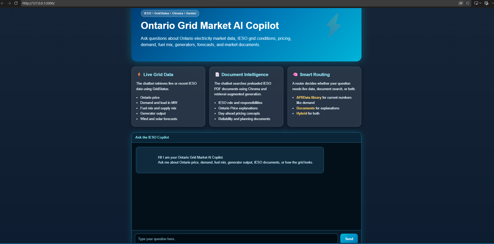
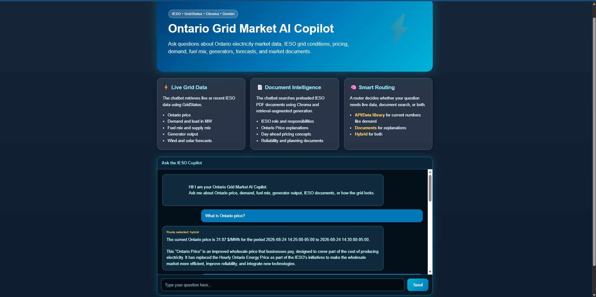
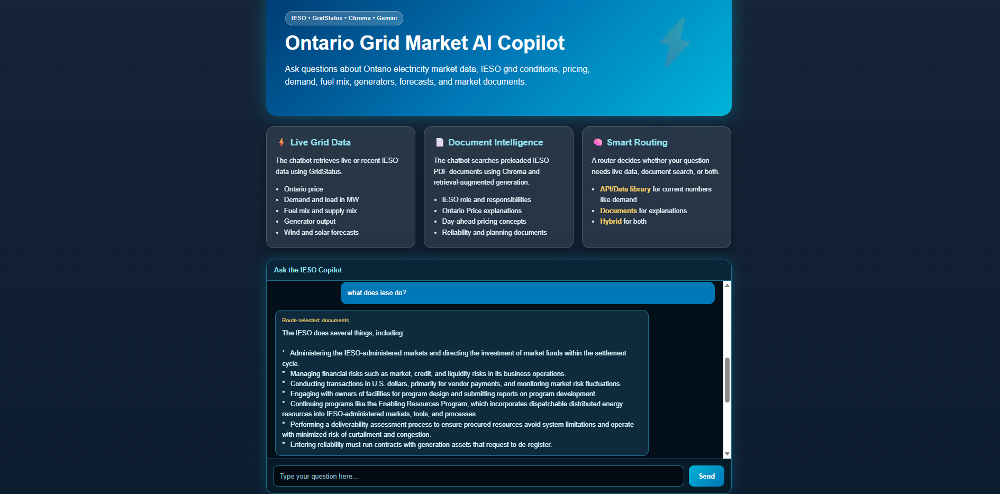
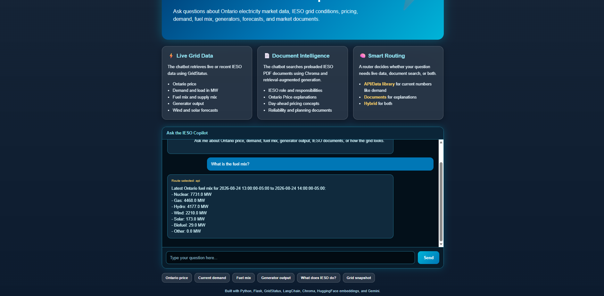

# Ontario Grid Market AI Copilot

A web-based AI chatbot that answers questions about Ontario electricity market data and IESO documents.

This project combines live/recent IESO grid data from GridStatus with retrieval-augmented generation over public IESO PDF documents. The chatbot can answer questions about Ontario price, demand, fuel mix, generator output, forecasts, market concepts, reliability, and planning.

---

## Screenshots

### Web Chatbot Interface



### Live Ontario Price Answer



### IESO Document Q&A



### Fuel Mix API Answer



---

## Features

- Flask web app with a custom HTML/CSS/JavaScript chatbot interface
- Live/recent IESO electricity market data using GridStatus
- Retrieval-augmented generation over IESO PDF documents
- Chroma vector database for document search
- HuggingFace sentence-transformer embeddings for local document indexing
- Google Gemini for routing, document answers, and hybrid answer summarization
- Smart routing between API, document, and hybrid questions
- Public IESO documents stored in the `docs/` folder
- Local `.env` based API key management

---

## Example Questions

The chatbot can answer questions such as:

```text
What is Ontario price?
What is the current Ontario demand in MW?
What is the fuel mix?
Show generator output.
What does IESO do?
What is day-ahead pricing?
How does the grid look?
```

---

## Tech Stack

- Python
- Flask
- GridStatus
- LangChain
- Chroma
- HuggingFace sentence-transformer embeddings
- Google Gemini
- Pandas
- HTML/CSS/JavaScript

---

## Project Structure

```text
RAG-ieso-grid-market-ai-bot/
├── assets/
│   └── screenshots/
│       ├── homepage.png
│       ├── ontario-price-answer.png
│       ├── document-qa-answer.png
│       └── fuel-mix-answer.png
├── docs/
├── website/
│   └── index.html
├── .env.example
├── .gitignore
├── build_vector_db.py
├── gridstatus_client.py
├── main.py
├── rag_engine.py
├── requirements.txt
├── router.py
└── web_app.py
```

---

## How It Works

The app uses a router to decide how each user question should be answered.

```text
User question
    ↓
router.py
    ↓
API route       → gridstatus_client.py
Document route  → rag_engine.py
Hybrid route    → GridStatus data + document explanation + Gemini summary
```

---

## 1. API/Data Route

Questions asking for current or recent grid data are sent to `gridstatus_client.py`.

Examples:

```text
What is Ontario price?
What is the current demand?
What is the fuel mix?
Show generator output.
```

This route uses GridStatus to retrieve IESO data such as:

- Real-time Ontario zonal price
- Day-ahead Ontario zonal price
- Real-time totals and demand
- Fuel mix
- Generator output
- Wind and solar forecasts
- Transmission and intertie-related data

---

## 2. Document/RAG Route

Questions asking for explanations, definitions, rules, or background are sent to `rag_engine.py`.

Examples:

```text
What does IESO do?
What is day-ahead pricing?
What does Ontario price mean?
How does Ontario's electricity market work?
```

The RAG pipeline works like this:

```text
IESO PDFs in docs/
    ↓
build_vector_db.py
    ↓
Text chunks + HuggingFace embeddings
    ↓
Chroma vector store
    ↓
Relevant context retrieved for the user's question
    ↓
Gemini generates a document-grounded answer
```

---

## 3. Hybrid Route

Some questions need both live data and explanation.

Examples:

```text
How does the grid look?
Explain the current Ontario price.
Is current demand high or low?
```

For these questions, the app retrieves live/recent GridStatus data, retrieves relevant document context, and uses Gemini to combine both into one clear answer.

---

## Setup Instructions

### 1. Clone the repository

```bash
git clone https://github.com/adi3mankotia/RAG-ieso-grid-market-ai-bot.git
cd RAG-ieso-grid-market-ai-bot
```

### 2. Create a virtual environment

On Windows PowerShell:

```powershell
python -m venv .venv
.\.venv\Scripts\Activate.ps1
```

On macOS/Linux:

```bash
python3 -m venv .venv
source .venv/bin/activate
```

### 3. Install dependencies

```bash
pip install -r requirements.txt
```

### 4. Create your `.env` file

Create a file named `.env` in the root project folder.

```env
GOOGLE_API_KEY=your_google_api_key_here
```

Do not commit your real `.env` file to GitHub.

### 5. Build the vector database

Run this once before using the document/RAG chatbot:

```bash
python build_vector_db.py
```

This reads the PDFs in `docs/`, splits them into chunks, creates local HuggingFace embeddings, and saves the Chroma database to `vector_store/`.

### 6. Run the web app

```bash
python web_app.py
```

Then open:

```text
http://127.0.0.1:5000
```

The website should also open automatically.

---

## Main Files

### `web_app.py`

Runs the Flask backend, serves the website, accepts user questions through the `/ask` route, calls the router, and returns answers to the frontend.

### `router.py`

Classifies each question as:

```text
api
documents
hybrid
```

It uses keyword logic for obvious questions and Gemini for ambiguous questions.

### `gridstatus_client.py`

Handles live/recent IESO data retrieval using GridStatus. It includes a catalog of IESO data functions and formats outputs for price, demand, fuel mix, generator output, forecasts, and grid snapshots.

### `rag_engine.py`

Handles document-based Q&A. It loads the Chroma vector database, retrieves relevant IESO document chunks, and asks Gemini to answer using the retrieved context.

### `build_vector_db.py`

Builds the local Chroma vector database from PDFs stored in `docs/`.

### `website/index.html`

Contains the frontend chatbot interface.

---

## Security Notes

This repository does not include the real `.env` file.

The following files and folders are ignored:

```text
.env
.venv/
__pycache__/
*.pyc
vector_store/
.vscode/
.DS_Store
```

Only `.env.example` is included as a template.

If an API key is ever exposed, revoke it immediately and create a new one.

---

## Limitations

- The app runs locally and is not deployed to a public server.
- The `vector_store/` folder is generated locally and is not committed to GitHub.
- GridStatus data depends on public IESO report availability.
- Gemini API usage depends on the user's own API key and quota.
- The app is intended as a portfolio/demo project, not a production electricity market tool.

---

## Resume Summary

Built a Flask-based AI chatbot that combines live IESO electricity market data from GridStatus with retrieval-augmented generation over IESO PDF documents using LangChain, Chroma, HuggingFace embeddings, and Gemini. Implemented smart routing to answer API, document, and hybrid questions about Ontario price, demand, fuel mix, generator output, and market concepts.

---

## Skills Demonstrated

- Retrieval-Augmented Generation
- API/data integration
- Vector databases
- Prompt engineering
- Flask web development
- Frontend chatbot UI design
- Data formatting with Pandas
- Environment variable and API key management
- Git/GitHub project documentation
